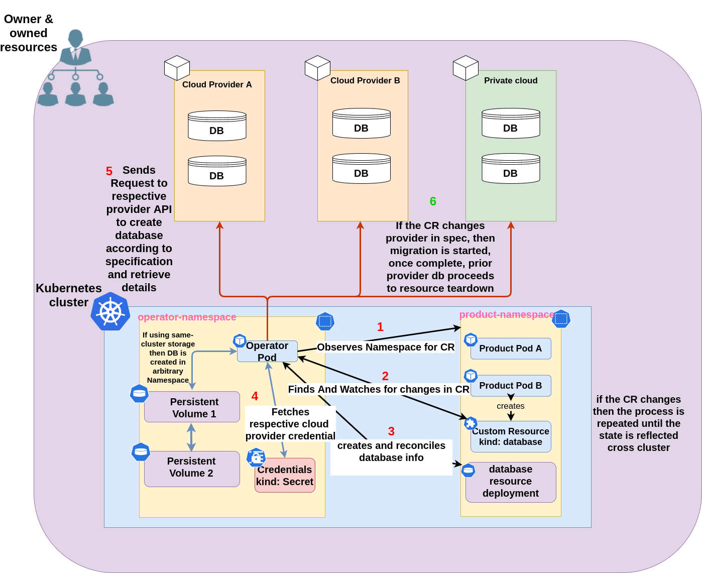

# Database Management And Migration Operator
A simple Kubernetes Operator based on the Operator-SDK to manage and migrate databases between cloud environments.

## (Warning)
This Operator is heavily ***Work In Progress*** as part of a final year project for my bachelors computing degree. 
(I cannot accept outside help for the near future). However feel free to fork/clone this repo to your hearts content.
## Overview

## Planned functionality
- Local database management and provisioning for MySQL(on-cluster)
- Cloud database management and provisioning for Azure (to be expanded to GCP/AWS/etc in the future)
- Data migration between environments (local-Azure / Azure-local etc.)
- Expanded configuration for deployments (non-priority)
- Table management 
